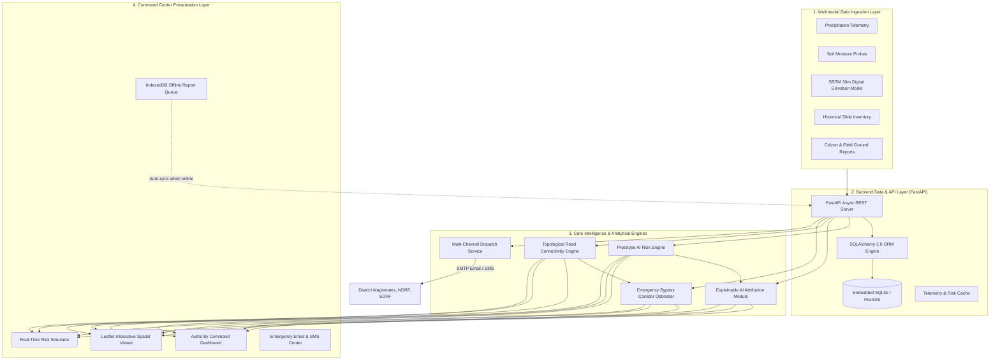
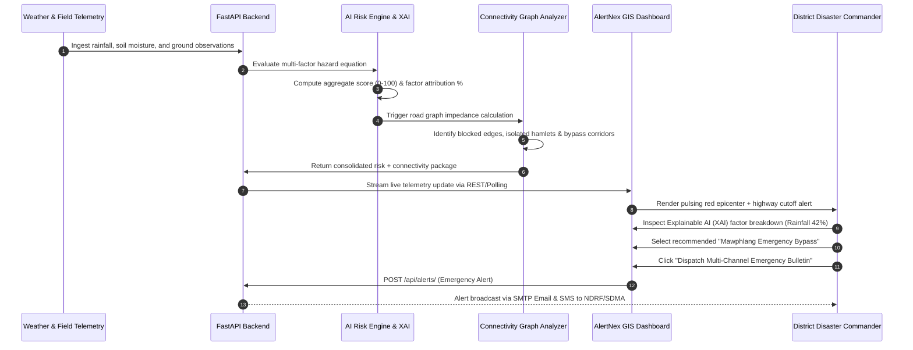

# AlertNex

<div align="center">

# 🚨 AlertNex — AI-Powered Landslide Early Warning & Decision-Support System
### Ministry of Development of North Eastern Region (MDoNER) | Smart India Hackathon 2026

[](https://github.com/ayush-tech3/MinistryofDevelopmentofNorthEasternRegion-MDoNER-/actions/workflows/ci.yml)
[](https://ayush-tech3.github.io/MinistryofDevelopmentofNorthEasternRegion-MDoNER-/)
[](https://ministryofdevelopmentofnortheastern.netlify.app/)
[](LICENSE)
[](https://www.python.org/)
[](https://fastapi.tiangolo.com/)
[](https://leafletjs.com/)
[](docker-compose.yml)
[](https://www.sih.gov.in/)
[](https://www.sih.gov.in/)

<p align="center">
  <strong>An intelligent, Explainable AI (XAI) early-warning platform and topological connectivity graph solver built for disaster management commanders in the North Eastern Region of India.</strong>
</p>

[Explore Live Web App](https://ministryofdevelopmentofnortheastern.netlify.app/) • [Download Official PPTX](AlertNex_Official_Presentation.pptx) • [Idea Description PDF](AlertNex_Idea_Description.pdf) • [Demo Walkthrough](DEMO_WALKTHROUGH.md) • [Pitch Deck](PITCH_DECK.md) • [Deploy Now](#-1-click-instant-cloud-deployment)

</div>

---

## 🏆 Official Submission Deliverables & Quick Links

| Deliverable | Resource / Link | Description |
| :--- | :--- | :--- |
| **🌐 Production Live App** | [ministryofdevelopmentofnortheastern.netlify.app](https://ministryofdevelopmentofnortheastern.netlify.app/) | Live, continuously deployed production command center on Netlify |
| **📑 Official Presentation PPTX** | [AlertNex_Official_Presentation.pptx](AlertNex_Official_Presentation.pptx) | Downloadable 6-slide official SIH presentation PowerPoint |
| **📝 Official Idea Description PDF** | [AlertNex_Idea_Description.pdf](AlertNex_Idea_Description.pdf) | Official 4-page SIH idea description submission PDF |
| **📄 Idea Description (Markdown)** | [IDEA_DESCRIPTION.md](IDEA_DESCRIPTION.md) | Complete 4-page idea description with team roster, workflow, and architecture |
| **📊 Presentation Deck (Markdown)** | [IDEA_PRESENTATION.md](IDEA_PRESENTATION.md) | Slide-by-slide 6-card representation of presentation deck |
| **🎥 Demo Walkthrough** | [DEMO_WALKTHROUGH.md](DEMO_WALKTHROUGH.md) | Complete step-by-step product walkthrough & evaluation timestamps |
| **📈 Executive Pitch Deck** | [PITCH_DECK.md](PITCH_DECK.md) | 8-slide structured competition pitch deck & ministry adoption plan |
| **📄 GitHub Pages Mirror** | [ayush-tech3.github.io/MDoNER](https://ayush-tech3.github.io/MinistryofDevelopmentofNorthEasternRegion-MDoNER-/) | Automated GitHub Pages mirror via GitHub Actions |
| **📂 Source Repository** | [github.com/ayush-tech3/MDoNER](https://github.com/ayush-tech3/MinistryofDevelopmentofNorthEasternRegion-MDoNER-) | Official source repository with commit history and branch controls |
| **📡 Interactive Swagger Docs** | `http://localhost:8000/docs` | OpenAPI 3.0 interactive API documentation & testing console |
| **📦 Architecture Guide** | [FRONTEND_INTEGRATION.md](FRONTEND_INTEGRATION.md) | In-depth technical architecture of GIS, AI Engine, and IndexedDB sync |

---

## ⚡ 1-Click Instant Cloud Deployment

Deploy your own instance of AlertNex with a single click on your preferred cloud platform:

| Platform | Deployment Button | Description | Configuration File |
| :--- | :---: | :--- | :--- |
| **Netlify** | [](https://app.netlify.com/start/deploy?repository=https://github.com/ayush-tech3/MinistryofDevelopmentofNorthEasternRegion-MDoNER-) | 1-Click static frontend deployment with edge routing | [`netlify.toml`](netlify.toml) |
| **Vercel** | [](https://vercel.com/new/clone?repository-url=https%3A%2F%2Fgithub.com%2Fayush-tech3%2FMinistryofDevelopmentofNorthEasternRegion-MDoNER-) | Instant serverless deployment with edge CDN caching | [`vercel.json`](vercel.json) |
| **Render** | [](https://render.com/deploy?repo=https://github.com/ayush-tech3/MinistryofDevelopmentofNorthEasternRegion-MDoNER-) | Full-stack blueprint deploying both FastAPI backend and GIS frontend | [`render.yaml`](render.yaml) |
| **Docker Compose** | `docker compose up --build` | Full-stack local containerization (PostGIS + FastAPI + Nginx) | [`docker-compose.yml`](docker-compose.yml) |
| **GitHub Codespaces** | [](https://github.com/codespaces/new?hide_repo_select=true&ref=main&repo=ayush-tech3%2FMinistryofDevelopmentofNorthEasternRegion-MDoNER-) | Instant cloud developer environment in browser | Built-in |

---

## 🎯 Problem Statement (SIH26001)

* **Problem Statement ID:** SIH26001
* **Target Ministry:** Ministry of Development of North Eastern Region (MDoNER)
* **Theme:** Disaster Management
* **Category:** Software / Decision Support System

### The Ground Crisis in the North Eastern Region
Landslides represent one of the most persistent and devastating natural hazards in India's **North Eastern Region (NER)**. The combination of steep Himalayan and Patkai terrain, intense seasonal monsoon cloudbursts (>11,000 mm annual rainfall in Meghalaya), fragile sedimentary rock strata, and high seismic sensitivity creates severe slope instability.

Critical highway arteries such as **NH-206 (Cherrapunji-Shella axis)**, **NH-27 (Haflong Pass)**, **NH-10 (Sikkim corridor)**, and **NH-29 (Kohima-Dimapur axis)** regularly suffer catastrophic slope failures that:
1. **Sever Lifeline Connectivity:** Mountain valleys are cut off from essential food, petroleum, and medical logistics for days or weeks.
2. **Trap Vulnerable Hamlets:** Single-access mountain villages become completely isolated with no accessible exit corridors.
3. **Impeded Emergency Response:** District disaster commanders lack real-time visibility into *which* specific roads are impassable and *what* alternative bypass corridors can carry heavy rescue vehicles.
4. **Lack of Explainable Warnings:** Traditional regional bulletins are too generic ("Heavy rainfall expected in Meghalaya") and lack the auditable factor attribution necessary for commanders to mobilize multimillion-rupee civil defence deployments.

**AlertNex** solves this crisis by combining multimodal telemetry ingestion, Explainable AI (XAI) risk scoring, topological road connectivity graph analysis, and resilient offline-first incident reporting.

---

## 🏗️ System Architecture & Data Flow



### End-to-End Hazard Escalation & Response Flow



---

## ✨ Key Features Checklist

- [x] **Authority Command Dashboard:** Real-time KPI summaries, active hazard distribution, live ticker, and system diagnostics.
- [x] **Interactive GIS Risk Map:** Leaflet.js spatial viewer with CartoDB topographic basemap, multi-tier animated risk epicenters, highway polylines, and critical infrastructure markers.
- [x] **AI Multi-Parameter Risk Engine:** Real-time hazard scoring (0–100) with interactive parameter sliders (Rainfall, Soil Moisture, Slope Angle, Geological Susceptibility, Ground Truth).
- [x] **Explainable AI (XAI) Attribution:** Mathematical decomposition of hazard scores into transparent percentage weights with impact badges (`HIGH IMPACT`, `MODERATE IMPACT`, `BASELINE`).
- [x] **Connectivity Impact Intelligence (Core Breakthrough):** Topological road graph analysis identifying cut-off highway links, single-access isolated villages, and transit delays to regional trauma centers.
- [x] **Emergency Bypass Corridor Recommender:** Algorithmic routing suggesting secondary bypass highways with calculated distance differentials ($\Delta$ km) and convoy delay estimates.
- [x] **Offline-First Field Incident Reporting:** Geotagged reporting with photo upload, GPS coordinates acquisition, and browser **IndexedDB** client caching for disconnected mountain valleys.
- [x] **One-Click Background Synchronization:** Seamless batch synchronization of stored offline incident reports upon network reconnection (`SYNC NOW`).
- [x] **Multi-Channel Emergency Alert Dispatch:** Official advisory generation with automated **SMTP email delivery** to District Magistrates/NDRF and simulated SMS cell-broadcasts.
- [x] **Automated 10-Phase Judge Simulation Mode:** Comprehensive state-machine demonstration simulating baseline conditions, cloudburst escalation, critical highway breach, and response mobilization.
- [x] **Mobile & Tablet Responsive:** Optimized viewport breakpoints, collapsible sidebar, touch-friendly GIS controls, and sleek dark command center styling.

---

## 🛠️ Technology Stack

| Layer | Technologies Used | Implementation Details |
| :--- | :--- | :--- |
| **Frontend Framework** | HTML5, Vanilla CSS3, Modern ES6+ JavaScript | Zero-dependency, lightning-fast Single Page Application (SPA) |
| **GIS & Mapping** | Leaflet.js 1.9.4, CartoDB Voyager Tiles | Hardware-accelerated vector rendering, dynamic risk buffer rings, GeoJSON layers |
| **Data Analytics** | Chart.js 4.4+ | Dynamic hazard distribution donut charts and temporal precipitation trends |
| **Offline Storage** | IndexedDB API, LocalStorage Fallback | Resilient client-side queuing of field reports in zero-connectivity valleys |
| **Backend Framework** | Python 3.12+, FastAPI 0.110+, Uvicorn 0.28+ | High-performance asynchronous REST API with automatic OpenAPI Swagger docs |
| **Data Validation** | Pydantic v2.6+ | Strict type enforcement and input validation for telemetry and incident models |
| **ORM & Database Layer** | SQLAlchemy 2.0, GeoAlchemy2 | Decoupled database layer supporting both embedded SQLite and enterprise PostgreSQL/PostGIS |
| **Database (Demo)** | SQLite 3 (`alertnex.db`) | Portable, zero-configuration embedded database for instant hackathon evaluation |
| **Database (Production)** | PostgreSQL 16 + PostGIS 3.4 | Enterprise spatial geodatabase configured in `docker-compose.yml` for production scale |
| **Notification Services** | Python `smtplib`, Twilio REST API | Production SMTP email dispatch and emergency cell-broadcast SMS simulation |
| **DevOps & CI/CD** | GitHub Actions, Netlify, Vercel, Docker Compose | Automated linting, testing, Pages publishing, and multi-cloud 1-click deployments |

---

## 🚀 Quick Start & Installation

### Prerequisites
* [Node.js](https://nodejs.org/) v18+ (Optional, only for running local static servers)
* [Python](https://www.python.org/) 3.10, 3.11, or 3.12+
* [Docker & Docker Compose](https://www.docker.com/) (Optional, for multi-container deployment)

---

### Step 1: Clone the Repository
```bash
git clone https://github.com/ayush-tech3/MinistryofDevelopmentofNorthEasternRegion-MDoNER-.git
cd MinistryofDevelopmentofNorthEasternRegion-MDoNER-
```

---

### Step 2: Run the Frontend (Zero-Build Static App)

The AlertNex frontend is a pure, zero-dependency SPA with integrated fallback data. It requires no `npm install` or compilation.

```bash
# Option A: Using Python's built-in HTTP server
cd alertnex-app
python -m http.server 8080

# Option B: Using Node http-server
npx -y http-server alertnex-app -p 8080
```
Open **`http://localhost:8080`** in your browser.

---

### Step 3: Run the FastAPI Backend & AI Risk Engine

```bash
# 1. Install Python dependencies
pip install -r backend/requirements.txt

# 2. Start the Uvicorn ASGI server with hot-reload
uvicorn backend.main:app --reload --host 0.0.0.0 --port 8000
```

Verify backend operations:
* **Root System Status:** `http://localhost:8000/`
* **Health Check Probe:** `http://localhost:8000/health`
* **Interactive Swagger UI:** `http://localhost:8000/docs`
* **ReDoc Documentation:** `http://localhost:8000/redoc`

---

### Step 4: Run via Docker Compose (Full-Stack Mode)

Spin up the entire stack (PostgreSQL with PostGIS extensions, FastAPI backend, and Nginx frontend) with one command:

```bash
docker compose up --build
```

Services will be mapped to:
* **Frontend Web App:** `http://localhost:3000`
* **FastAPI Backend:** `http://localhost:8000`
* **PostGIS Spatial Database:** `localhost:5432`

---

### Step 5: Run Automated Test Suite

```bash
# Run pytest test suite
PYTHONPATH=. pytest -v backend/tests/

# Run flake8 linter
flake8 backend --count --max-line-length=127 --statistics
```

---

## 🌐 Cloud Deployment Guide

### 1. Netlify Deployment (Live Production)
AlertNex is pre-configured with `netlify.toml`:
* **Publish Directory:** `alertnex-app`
* **Build Command:** `echo "AlertNex Static Frontend Ready"`
* **Custom Security Headers:** `X-Frame-Options`, `X-Content-Type-Options`, immutable cache headers for CSS/JS assets.
* **1-Click Deploy:** Click the **Deploy to Netlify** button in the top section of this README.

### 2. Vercel Deployment
Configured via `vercel.json`:
* **Output Directory:** `alertnex-app`
* **Clean URLs:** Enabled
* **1-Click Deploy:** Click the **Deploy with Vercel** button above.

### 3. Render Deployment
Configured via `render.yaml` Blueprint:
* Automatically provisions the FastAPI backend web service and static frontend web service simultaneously.
* **1-Click Deploy:** Click the **Deploy to Render** button above.

### 4. GitHub Pages Deployment
Configured via `.github/workflows/deploy-pages.yml`:
* Automatically publishes updates to `https://ayush-tech3.github.io/MinistryofDevelopmentofNorthEasternRegion-MDoNER-/` on every push to the `main` branch.

---

## 📡 REST API Documentation

| Method | Endpoint | Description | Sample Request / Payload | Sample Response |
| :--- | :--- | :--- | :--- | :--- |
| `GET` | `/` | Root system status & version | None | `{"system": "AlertNex", "status": "ONLINE"}` |
| `GET` | `/health` | Application health diagnostic probe | None | `{"status": "healthy", "timestamp": "..."}` |
| `GET` | `/api/zones/` | List all monitored NER geological sectors | None | `[{"id": 1, "name": "Cherrapunji Slopes", ...}]` |
| `GET` | `/api/zones/{id}` | Detailed telemetry for specific zone | None | `{"id": 1, "rainfall_24h": 68.5, ...}` |
| `GET` | `/api/risk/{zone_id}` | Calculate real-time risk & Explainable AI factors | None | `{"risk_score": 78.4, "classification": "CRITICAL"}` |
| `POST` | `/api/risk/evaluate` | Custom telemetry risk simulation | `{"rainfall": 85, "soil_moisture": 90, ...}` | `{"risk_score": 88.2, "factors": [...]}` |
| `GET` | `/api/connectivity/{zone_id}` | Road disruption & village isolation analysis | None | `{"disrupted_roads": [...], "isolated_villages": [...]}` |
| `GET` | `/api/reports/` | List citizen & field incident reports | None | `[{"id": 1, "hazard_type": "Rockfall", ...}]` |
| `POST` | `/api/reports/` | Submit new field ground truth report | `{"zone_id": 1, "hazard_type": "Mudflow", ...}` | `{"status": "recorded", "report_id": 12}` |
| `GET` | `/api/alerts/` | List active emergency advisories & bulletins | None | `[{"id": 1, "severity": "CRITICAL", ...}]` |
| `POST` | `/api/alerts/` | Broadcast emergency alert (Email + SMS) | `{"zone_id": 1, "severity": "HIGH", ...}` | `{"status": "dispatched", "channels": ["email", "sms"]}` |

---

## 📊 Prototype Risk Engine & Explainable AI (XAI)

The prototype risk scoring and Explainable AI (XAI) attribution engine utilizes an auditable multi-factor formula calibrated to North Eastern geotechnical conditions:

$$\text{Risk Score} = (R \times 0.30) + (SM \times 0.25) + (S \times 0.20) + (H \times 0.15) + (FR \times 0.10)$$

Where:
* $R$ = Normalized 24-hour Cumulative Rainfall Intensity (0–100 scale) — **30% Weight**
* $SM$ = Subsurface Soil Moisture Saturation percentage (0–100 scale) — **25% Weight**
* $S$ = Terrain Slope Gradient angle normalized (0–100 scale) — **20% Weight**
* $H$ = Historical Landslide Activity Frequency Index (0–100 scale) — **15% Weight**
* $FR$ = Verified Field Ground Truth Observations (0–100 scale) — **10% Weight**

### Explainable AI (XAI) Factor Decomposition
Rather than delivering an opaque "black-box" risk number, AlertNex calculates the exact percentage contribution of each variable:

$$\text{Contribution}_i = \frac{w_i \cdot x_i}{\sum_{j} (w_j \cdot x_j)} \times 100\%$$

| Risk Range | Hazard Classification | Operational Action Protocol |
| :---: | :---: | :--- |
| **0 – 25** | 🟢 **LOW** | Normal baseline monitoring; routine automated telemetry polling. |
| **26 – 50** | 🟡 **MODERATE** | Advisory watch active; maintenance crews on standby; drainage clearance. |
| **51 – 75** | 🟠 **HIGH** | Heavy equipment mobilized; single-lane traffic regulation; alerts issued. |
| **76 – 100** | 🔴 **CRITICAL** | Lifeline highway closure; alternative bypass activated; standby evacuation. |

---

## 🗺️ Calibrated Demonstration Sectors

AlertNex demo data has been realistically calibrated to represent authentic geographic and meteorological realities across the North Eastern Region:

1. **Sector 1: Cherrapunji-Mawsynram Escarpment (East Khasi Hills, Meghalaya)**
   * *Coordinates:* $25.2986^\circ\text{ N}, 91.5822^\circ\text{ E}$
   * *Profile:* Ultra-high monsoon precipitation (>11,000 mm/yr) on steep limestone and sandstone cliffs.
   * *Critical Corridor:* NH-206 (Sohra-Shella lifeline road).
2. **Sector 2: Haflong-Jatinga Hill Pass (Dima Hasao, Assam)**
   * *Coordinates:* $25.1764^\circ\text{ N}, 93.0238^\circ\text{ E}$
   * *Profile:* Highly unstable shale and clay formations causing recurring road and railway subsidence.
   * *Critical Corridor:* NH-27 (East-West Highway Corridor) and Lumding-Badarpur railway link.
3. **Sector 3: Gangtok-Tsomgo Alpine Pass (East Sikkim)**
   * *Coordinates:* $27.3742^\circ\text{ N}, 88.7619^\circ\text{ E}$
   * *Profile:* High-altitude moraine and glacial scree slopes subject to flash-freeze-thaw rockfalls.
   * *Critical Corridor:* Jawaharlal Nehru Marg (Strategic defense & tourism axis to Nathu La).
4. **Sector 4: Kohima-Dimapur Valley (Nagaland)**
   * *Coordinates:* $25.6751^\circ\text{ N}, 94.1086^\circ\text{ E}$
   * *Profile:* Active urban slope creep and river-toe erosion during sustained monsoon precipitation.
   * *Critical Corridor:* NH-29 (Primary economic lifeline into Manipur).

---

## 🔒 Security, Resiliency & Academic Honesty

### Academic Honesty Disclosures (SIH Evaluation Integrity)
1. **Sensors & Telemetry:** Rainfall and soil moisture telemetry are currently calibrated simulations and baseline datasets; physical IoT hardware is not deployed in the competition hall.
2. **Decision-Support Scope:** Alternative bypass routes and warning bulletins are algorithmic recommendations designed for civil commanders and do not constitute official military/police transit directives.
3. **Database Architecture:** Dual-mode architecture uses an embedded SQLite instance out-of-the-box for portable, zero-setup hackathon evaluation while maintaining 100% SQLAlchemy ORM compatibility with enterprise PostgreSQL/PostGIS.

### Security Architecture
* **Cross-Origin Protection:** Strict CORS origin whitelisting in FastAPI backend.
* **Security Headers:** HTTP response headers (`X-Frame-Options`, `X-Content-Type-Options`, `Referrer-Policy`) enforced in Nginx, Netlify, and Vercel.
* **Input Sanitization:** Pydantic v2 strict schema verification guarding all API inputs against injection.
* **Environment Secrets:** Sensitive credentials (SMTP passwords, API keys) stored exclusively in `.env`, never committed to source control.

---

## 📁 Repository Structure

```
MinistryofDevelopmentofNorthEasternRegion(MDoNER)/
├── .github/
│   └── workflows/
│       ├── ci.yml                    # Automated linting & pytest test execution
│       └── deploy-pages.yml          # GitHub Pages automated publishing workflow
├── alertnex-app/                     # Complete SPA Frontend (Netlify & Vercel Root)
│   ├── index.html                    # Single-page application entry point (10 views)
│   ├── assets/                       # Static media, icons, and map overlays
│   ├── css/
│   │   ├── style.css                 # Dark command center styling & glassmorphism
│   │   └── responsive.css            # Tablet & mobile responsive breakpoints
│   └── js/
│       ├── api.js                    # REST API client with automatic offline fallback
│       ├── app.js                    # SPA hash router, clocks, toast notifications
│       ├── data.js                   # Seed datasets for 4 NER zones, roads, villages
│       ├── map.js                    # Leaflet GIS engine, risk buffer rings, layers
│       ├── ai-engine.js              # Multi-factor risk engine & Explainable AI attribution
│       ├── connectivity.js           # Topological road cutoff & bypass solver
│       ├── alerts.js                 # Multi-channel alert dispatch (Email/SMS)
│       ├── reporting.js              # Field incident submission & IndexedDB queue
│       ├── simulation.js             # 10-phase automated judge demo controller
│       └── charts.js                 # Chart.js temporal hazard visualizations
├── backend/                          # FastAPI Asynchronous REST Backend
│   ├── main.py                       # App entry point, CORS, lifespan, router includes
│   ├── database.py                   # SQLAlchemy engine & SQLite/PostgreSQL config
│   ├── requirements.txt              # Python production dependencies
│   ├── .env.example                  # Backend environment template
│   ├── Dockerfile                    # Containerization specification for backend
│   ├── models/                       # SQLAlchemy models (Zone, Report, Alert, Road)
│   ├── routers/                      # REST endpoints (zones, risk, reports, alerts, connectivity)
│   ├── schemas/                      # Pydantic validation schemas
│   ├── services/                     # Risk calculation, graph solver, email service
│   ├── tests/                        # Pytest automated test suite
│   └── utils/
│       └── seed_data.py              # Automatic seeding of realistic NER demo data
├── docs/                             # Official SIH Proposal PDFs & Generators
├── presentation/                     # PowerPoint Decks (.pptx) & Slide Builders
├── AlertNex_Official_Presentation.pptx # Official 6-slide SIH PowerPoint Presentation
├── AlertNex_Idea_Description.pdf      # Official 4-page SIH Idea Description PDF
├── IDEA_DESCRIPTION.md                # 4-page idea description (Markdown)
├── IDEA_PRESENTATION.md               # 6-slide presentation deck (Markdown)
├── DEMO_WALKTHROUGH.md               # Step-by-step product demonstration guide
├── docker-compose.yml                # Multi-container orchestration (PostGIS, FastAPI, Nginx)
├── Dockerfile                        # Root multi-stage Docker build file
├── FRONTEND_INTEGRATION.md           # In-depth frontend technical architecture guide
├── index.html                        # Root redirector to alertnex-app/index.html
├── LICENSE                           # Official MIT License
├── netlify.toml                      # Netlify continuous deployment config
├── PITCH_DECK.md                     # Structured competition pitch deck
├── render.yaml                       # Render Blueprint full-stack deployment config
├── vercel.json                       # Vercel static deployment config
└── README.md                         # Master project documentation
```

---

## 👥 Team AlertNex & Submission Credentials

* **Team Name:** AlertNex
* **Team Leader:** Ayush Kumar
* **Smart India Hackathon:** Smart India Hackathon 2026
* **Problem Statement ID:** SIH26001
* **Ministry Sponsor:** Ministry of Development of North Eastern Region (MDoNER)
* **Theme:** Disaster Management
* **Category:** Software
* **Repository:** [https://github.com/ayush-tech3/MinistryofDevelopmentofNorthEasternRegion-MDoNER-](https://github.com/ayush-tech3/MinistryofDevelopmentofNorthEasternRegion-MDoNER-)
* **Live Deployment:** [https://ministryofdevelopmentofnortheastern.netlify.app/](https://ministryofdevelopmentofnortheastern.netlify.app/)

---

## 📄 License

This project is licensed under the **MIT License** — see the [LICENSE](LICENSE) file for details.

<div align="center">
  <sub>Developed with dedication by Team AlertNex for the Ministry of Development of North Eastern Region (MDoNER) | Smart India Hackathon 2026</sub>
</div>
