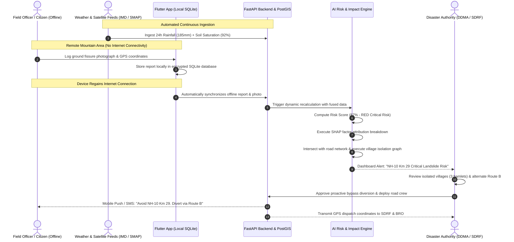

# SMART INDIA HACKATHON 2026 — IDEA SUBMISSION
## COLLEGE INTERNAL SELECTION ROUND

---

### **PROJECT OVERVIEW CARD**
* **Project Title:** AI-Based Early Warning and Landslide Monitoring System in NER
* **Problem Statement ID:** **SIH26001**
* **Organization:** Ministry of Development of North Eastern Region (MDoNER)
* **Category:** Software Edition
* **Theme:** Disaster Management
* **Team Name:** **AlertNex**
* **Team Leader:** **Ayush Kumar**
* **Target Geography:** 8 North Eastern States (Sikkim, Assam, Meghalaya, Arunachal Pradesh, Nagaland, Manipur, Mizoram, Tripura)

---

## 1. PROJECT TITLE
**AI-Based Early Warning and Landslide Monitoring System in North Eastern Region (NER)**

---

## 2. TEAM DETAILS

* **Team Name:** **AlertNex**
* **Team Leader:** **Ayush Kumar**

| No. | Member Name | Official Role | Primary Responsibilities |
| :---: | :--- | :--- | :--- |
| 1 | **Ayush Kumar** | **Team Leader** | AI/ML, System Architecture, Overall Coordination |
| 2 | **Prerana Mondal** | **Team Member** | Frontend Development, UI/UX, Data Visualization |
| 3 | **Sondeep Kumar** | **Team Member** | Backend Development, Database, API Integration |
| 4 | **Shinjini Lohar** | **Team Member** | AI/ML, Computer Vision, Data Processing |
| 5 | **Subham Kumar Modi** | **Team Member** | GIS Analysis, Mobile Application, QA Testing |
| 6 | **Rahul Deo** | **Team Member** | Cloud Infrastructure, DevOps, Testing and Security |

---

## 3. PROBLEM UNDERSTANDING

### 3.1 The Geo-Climatic Crisis in the North Eastern Region
The North Eastern Region (NER) of India is one of the most landslide-prone regions in the world. Characterized by geologically young, seismically active Himalayan mountain systems and intense monsoon rainfall (>150–200 mm/day), the region experiences catastrophic slope failures every year.

### 3.2 Ground Bottlenecks in NER
1. **Steep Mountainous Terrain:** The rugged terrain makes physical ground inspection dangerous and leaves vast areas unmonitored.
2. **Single Arterial Lifeline Roads:** Arterial highways like NH-10 (Sikkim’s lifeline) and NH-29 (Nagaland/Manipur) suffer recurring blockages, cutting off food supplies, fuel, and medical aid.
3. **Isolated Remote Villages:** Deep mountain valley communities depend on single access roads. A landslide traps hundreds of families without hospital access.
4. **Poor Internet and Power Blackouts:** Severe storms frequently knock out cellular towers and electricity, preventing locals from transmitting distress signals.
5. **Delayed Information & Reactive Response:** Disaster authorities receive ground information hours or days after landslides occur, forcing teams into reactive post-disaster rescue rather than proactive early evacuation.
6. **The Critical Gap:** Conventional research models merely predict *landslide probability* in a district. They fail to predict the **practical impact**—which roads will be blocked, which villages will be isolated, and which hospitals will become inaccessible.

---

## 4. PROPOSED SOLUTION

**AlertNex** is an AI-powered disaster decision-support and early-warning platform designed specifically for the geographical and infrastructural realities of the North Eastern Region. 

Rather than acting as a simple hazard map, AlertNex combines multi-source environmental sensing with community ground intelligence to calculate dynamic landslide risk at 30-meter resolution and instantly translates that risk into **Connectivity Impact Intelligence**.

### Dynamic Risk Categorization:
* 🟢 **GREEN (Low Risk | 0–30%):** Normal terrain stability. Automated satellite and weather polling. Regular traffic.
* 🟡 **YELLOW (Moderate Risk | 31–60%):** Elevated moisture saturation. Advisories issued to Border Roads Organisation (BRO) and highway patrols.
* 🟠 **ORANGE (High Risk | 61–80%):** Critical moisture threshold. Freight diversions triggered; village disaster committees alerted.
* 🔴 **RED (Critical Risk | 81–100%):** Imminent landslide danger. Automated SMS/push alerts, bypass routes activated, pre-positioning of SDRF/NDRF rescue teams.

---

## 5. SYSTEM WORKFLOW

```
  [1. DATA COLLECTION LAYER]
  ├── Rainfall & Weather Data (IMD API, NASA GPM)
  ├── Soil Moisture (NASA SMAP Satellite)
  ├── Terrain & Slope (SRTM 30m Digital Elevation Model)
  ├── Satellite Imagery (Sentinel-2 Optical Data)
  ├── Historical Landslides (Geological Survey of India - GSI Bhukosh)
  └── Citizen & Field Officer Reports (Mobile App)
                           │
                           ▼
  [2. DATA PROCESSING LAYER]
  ├── Spatial interpolation & coordinate harmonization (WGS84)
  ├── Antecedent Precipitation Index (24h, 72h, 7-day cumulative rainfall)
  └── Feature normalization & slope instability matrix construction
                           │
                           ▼
  [3. AI RISK ENGINE]
  ├── Machine learning ensemble (XGBoost + Random Forest)
  ├── 30m pixel-level slope failure susceptibility calculation
  └── Explainable AI (SHAP) factor weight attribution
                           │
                           ▼
  [4. DYNAMIC RISK SCORE]
  └── Classification: GREEN (Low) | YELLOW (Moderate) | ORANGE (High) | RED (Critical)
                           │
                           ▼
  [5. GIS RISK MAPPING]
  └── Dynamic PostGIS spatial heatmap overlay on OpenStreetMap / Mapbox
                           │
                           ▼
  [6. CONNECTIVITY IMPACT ANALYSIS]
  ├── Road Blockage Prediction (Intersection of high-risk zones with highways)
  ├── Village Isolation Detection (Graph connectivity check on isolated villages)
  ├── Hospital Accessibility Matrix (Calculates travel delay & cut-off health centers)
  └── Alternative Emergency Route Computation (Dijkstra algorithm)
                           │
                           ▼
  [7. EARLY WARNING & ACTION OUTPUTS]
  ├── Authority Web Dashboard (React.js + Leaflet/Mapbox)
  ├── Citizen & Field Mobile Application (Flutter + SQLite Offline Sync)
  └── Multi-Agency Siren & SMS Alerts (Firebase Cloud Messaging)
```

---

## 6. KEY FEATURES

| Feature | Target Audience | Practical Capability |
| :--- | :--- | :--- |
| **Dynamic AI Risk Scoring** | District Authorities | Continuously updates slope risk scores (Green/Yellow/Orange/Red) as monsoon rainfall accumulates. |
| **Interactive GIS Risk Map** | SDRF / MDoNER / DDMA | High-resolution spatial map showing threatened road corridors, slopes, and safe zones. |
| **Road Blockage Analysis** | Traffic Police / BRO | Identifies specific highway points likely to be cut off before debris slides occur. |
| **Village Isolation Predictor** | District Magistrates | Lists all remote villages at risk of being completely cut off with population counts. |
| **Hospital Accessibility Matrix** | Emergency Services / 108 | Flags which primary health centers and district hospitals will become unreachable. |
| **Dynamic Alternate Route Planner** | Ambulances / Convoys | Computes safe bypass corridors to maintain medical and supply transit. |
| **Offline Mobile Reporting** | Citizens / Field Patrols | Captures geotagged photos of tension cracks without internet, auto-syncing when network returns. |
| **Explainable AI (XAI)** | Disaster Decision Makers | Transparently shows *why* a location is high-risk (e.g. Rainfall 42%, Moisture 21%, Slope 15%). |
| **Multi-Channel Early Warning** | Public & Transporters | Instant SMS and push notifications alerting commuters to avoid endangered road segments. |

---

## 7. INNOVATION & UNIQUENESS (USPs)

### 🌟 Core Innovation: Dynamic Risk + Connectivity Impact Analysis
Traditional disaster systems stop at hazard probability ("75% chance of landslide in district"). AlertNex answers the operational question: **"What happens if a landslide strikes?"**
* Predicts specific road blockages on lifeline highways.
* Identifies which villages will become isolated.
* Highlights hospitals that will lose road connectivity.
* Autonomously suggests alternative emergency routes before disaster strikes.

### 🌟 Second Innovation: Offline Community and Field Reporting
In remote Himalayan valleys where cellular networks frequently collapse during storms:
* Citizens and field officers use a mobile app that works **100% offline**.
* Ground observations (cracks, soil creep, rockfalls, blocked culverts) are geotagged and stored in a **local SQLite database**.
* When the user's phone reconnects to 2G, 3G, 4G, or Wi-Fi, the report **automatically synchronizes** with the central server.

### 🌟 Third Innovation: Explainable AI (XAI)
Government officials will not order road closures or evacuations based on a black-box percentage. AlertNex provides clear, auditable explanations:
```
ALERT STATUS: CRITICAL RISK — 87%
LOCATION: NH-10 KM 29 (29th Mile Stretch)

FACTOR BREAKDOWN:
• Heavy Rainfall (24-Hour Accumulation: 185 mm): 42% contribution
• High Soil Moisture Saturation (92%): 21% contribution
• Steep Terrain Gradient (48° Slope): 15% contribution
• Historical Landslide Precedent (3 past slips): 5% contribution
• Recent Field Report (Citizen logged road fissure): 4% contribution
```

---

## 8. TECHNOLOGY STACK

Every tool in the AlertNex architecture has a clear, practical purpose:

* **Frontend Web Dashboard — React.js (v18):** Delivers a responsive, lightweight authority interface for desktop and tablet screens in emergency control rooms.
* **Mobile Application — Flutter (Dart):** Single codebase for Android and iOS with native camera access, GPS tagging, and clean performance.
* **Offline Local Storage — SQLite (`sqflite`):** Securely caches ground reports, photos, and coordinates on mobile devices when internet is unavailable.
* **Backend API — Python 3.11 + FastAPI:** Asynchronous, high-performance REST API handling telemetry ingestion and multi-user requests.
* **Machine Learning Engine — Python + Scikit-learn + XGBoost:** Efficient gradient-boosted ensemble that computes dynamic susceptibility without requiring expensive GPU clusters.
* **Explainable AI — SHAP (SHapley Additive exPlanations):** Translates complex machine learning weights into human-understandable percentage factor contributions.
* **Geospatial Database — PostgreSQL 16 + PostGIS:** Industry-standard spatial database performing rapid geometric intersection queries between hazard polygons and road networks.
* **GIS Mapping — Leaflet.js / Mapbox GL:** Renders interactive, fast-loading map layers and contour visualizations.
* **Data Processing — Pandas & NumPy:** Handles time-series rainfall aggregation and matrix normalization.
* **Notifications & Cloud — Firebase Cloud Messaging (FCM) + AWS EC2:** Powers instant push alerts and hosts containerized microservices.

---

## 9. IMPLEMENTATION PLAN

| Phase | Title | Deliverables | Student Team Focus |
| :---: | :--- | :--- | :--- |
| **Phase 1** | **Data Collection & Curation** | Download SRTM 30m DEM for pilot region (Sikkim/Assam); fetch historical GSI Bhukosh landslide records; mock IMD rainfall feeds. | Ayush Kumar & Shinjini Lohar |
| **Phase 2** | **AI Risk Model & XAI Development** | Train XGBoost/Random Forest models on combined terrain and rainfall features; integrate SHAP explainer for factor breakdowns. | Ayush Kumar & Shinjini Lohar |
| **Phase 3** | **GIS Visualization & PostGIS** | Configure PostgreSQL with PostGIS; build React.js web dashboard with Leaflet/Mapbox 4-color risk polygon overlays. | Prerana Mondal & Sondeep Kumar |
| **Phase 4** | **Connectivity Impact Engine** | Implement graph algorithms (Dijkstra) to detect blocked road links, identify isolated village nodes, and compute bypass routes. | Sondeep Kumar & Subham Kumar Modi |
| **Phase 5** | **Mobile App & Offline Reporting** | Build Flutter mobile application with SQLite local storage, photo capture, GPS tagging, and auto-sync worker. | Subham Kumar Modi & Rahul Deo |
| **Phase 6** | **Testing & Prototype Demonstration** | Simulate a 185 mm cloudburst scenario; test offline report sync and route rerouting; perform end-to-end QA validation. | Rahul Deo & All Members |

---

## 10. TECHNICAL FEASIBILITY

1. **No Reliance on Costly Physical Sensors:** Traditional systems demand millions of rupees for borehole inclinometers and wire extensometers. AlertNex uses **remote sensing, open satellite data, and crowd intelligence**.
2. **Open Data Availability:**
   * NASA SMAP (soil moisture) and SRTM DEM (elevation) are freely available.
   * IMD gridded rainfall feeds and NASA GPM precipitation data are accessible via public APIs.
   * GSI Bhukosh provides open landslide inventories for the North East.
   * OpenStreetMap (OSM) provides open topological road network shapefiles.
3. **Realistic Student Team Execution:** The modular architecture allows all 6 team members to build frontend, backend, ML, mobile, and GIS components independently and integrate via clean REST APIs.
4. **Transparent, Grounded Claims:** AlertNex is designed as an **early-warning decision-support tool** to minimize loss of life and organize logistical response—not an impossible 100% predictive oracle.

---

## 11. EXPECTED IMPACT

* **6 to 12-Hour Warning Window:** Replaces chaotic post-disaster rescue with orderly pre-disaster evacuation.
* **Lifeline Highway Protection:** Mitigates severe passenger stranding and vehicular pileups along NH-10 and NH-29.
* **Voice for Remote Hamlets:** Zero blindspots—offline reporting ensures that cut-off tribal villages are not forgotten during storms.
* **Targeted Resource Deployment:** Directs SDRF and BRO earthmovers to clear high-priority choke points first.
* **Economic Continuity:** Mitigates multi-crore losses stemming from severed trade corridors and post-disaster reconstruction bills.

---

## 12. FUTURE SCOPE

* **Drone Monitoring:** Automated UAV flights along flagged ground fissures for millimeter-level 3D terrain modeling.
* **Advanced Satellite Radar (InSAR):** Sentinel-1 radar interferometry to monitor slow hill creep before catastrophic failure occurs.
* **Emergency Service Integration:** Direct API integration with **112 India**, **NDMA National Emergency Communication Plan**, and **BRO Project Swastik**.
* **Regional Language Audio Support:** Multilingual voice alerts in Assamese, Bengali, Nepali, Mizo, Khasi, Garo, and Bodo.
* **Himalayan Expansion:** Scaling the platform to Uttarakhand, Himachal Pradesh, and Jammu & Kashmir.

---

## 13. SYSTEM ARCHITECTURE DIAGRAM

```mermaid
flowchart TD
    subgraph DATA["1. DATA COLLECTION LAYER"]
        D1["Rainfall & Weather (IMD API, NASA GPM)"]
        D2["Soil Moisture (NASA SMAP)"]
        D3["Terrain & Slope (SRTM 30m DEM)"]
        D4["Satellite Data (Sentinel-2 Optical)"]
        D5["Historical Landslides (GSI Bhukosh)"]
        D6["Citizen & Field Officer Reports (Mobile App)"]
    end

    subgraph ENGINE["2. AI AND ANALYTICS ENGINE"]
        E1["FastAPI Ingestion & Data Harmonization (Pandas, NumPy)"]
        E2["Antecedent Moisture & Cumulative Rainfall Pipeline"]
        E3["Machine Learning Risk Model (XGBoost / Scikit-learn)"]
        E4["Explainable AI (SHAP Factor Attribution Breakdown)"]
        E5["Dynamic Risk Score: GREEN | YELLOW | ORANGE | RED"]
    end

    subgraph GIS["3. GIS AND IMPACT ANALYSIS LAYER"]
        G1["PostgreSQL 16 + PostGIS Spatial Geodatabase"]
        G2["Road Blockage Analysis (Spatial Intersection)"]
        G3["Village Isolation Analysis (Graph Connectivity)"]
        G4["Hospital Accessibility Matrix"]
        G5["Emergency Alternative Routes (Dijkstra / pgRouting)"]
    end

    subgraph OUTPUT["4. OUTPUT & EARLY WARNING DISPATCH"]
        O1["Authority Command Dashboard (React.js + Leaflet/Mapbox)"]
        O2["Citizen & Field Mobile Application (Flutter + SQLite)"]
        O3["Early Warning Alerts (Firebase Push & SMS Broadcast)"]
        O4["Emergency Tactical Directives for DDMA / SDRF / BRO"]
    end

    D1 --> E1
    D2 --> E1
    D3 --> E1
    D4 --> E1
    D5 --> E1
    D6 -->|Auto-Sync on Reconnect| E1

    E1 --> E2 --> E3 --> E4 --> E5
    E5 --> G1
    G1 --> G2 --> G3 --> G4 --> G5

    G2 --> O1
    G3 --> O1
    G4 --> O1
    G5 --> O1

    E5 --> O2
    G5 --> O2
    E5 --> O3
    G5 --> O4
```



---

## 14. PROJECT WORKFLOW DIAGRAM



---

## 15. PROTOTYPE DEMONSTRATION SCENARIO

**Scenario:** Heavy Monsoon Downpour along the **NH-10 Teesta Valley Corridor (Sikkim–West Bengal border)**.

1. **Step 1: Environmental Triggers Accumulate**
   * Heavy rainfall is simulated in the system. The 24-hour rainfall crosses 185 mm, and soil moisture saturation index hits 92%.
2. **Step 2: Dynamic Risk Escalation**
   * The AI Risk Engine processes the environmental triggers.
   * The risk score for the stretch escalates from **MODERATE (Yellow)** to **HIGH (Orange)**, and finally to **CRITICAL (Red — 87%)**.
3. **Step 3: GIS Map & Explainable AI in Action**
   * The interactive GIS map flags the 3 km stretch near 29th Mile in bright red.
   * Clicking the hazard polygon opens the **Explainable AI Inspector**:
     * *Heavy Rainfall (185 mm past 24h): 42% contribution*
     * *High Soil Moisture (92% saturation): 21% contribution*
     * *Steep Terrain Gradient (>48° slope): 15% contribution*
     * *Field Crack Observation: 9% contribution*
4. **Step 4: Connectivity & Impact Analysis**
   * The system immediately runs the graph connectivity algorithm:
     * **Road Blockage:** *NH-10 Km 29 choke point identified.*
     * **Village Isolation:** *3 Villages (Lower Melli, Tarkhola, Rambi) with 4,200 residents identified as isolated.*
     * **Hospital Accessibility:** *Singtam District Hospital inaccessible via primary route.*
     * **Alternative Route:** *Autonomous generation of Route B (Damdim–Algarah–Reshi–Rhenock corridor), keeping travel open.*
5. **Step 5: Offline Field Reporting & Auto-Synchronization**
   * A field officer in an offline valley notices ground subsidence and submits a photo via the Flutter mobile app.
   * The app prompts: *"Saved offline to SQLite database"*.
   * Once the device connects to mobile data, the report auto-syncs, validating the AI's critical alert.
6. **Step 6: Proactive Emergency Action**
   * Instant SMS warnings are pushed to registered drivers in the area.
   * SDRF and BRO teams receive tactical coordinates to pre-deploy earthmovers before the road collapses.

---

## 16. 60-SECOND PROFESSOR PITCH

> *"Respected professors and evaluation committee,*
> 
> *Every monsoon, devastating landslides paralyze the North Eastern Region. Arterial lifelines like NH-10 and NH-29 are severed, cutting off food supplies, trapping emergency ambulances, and isolating remote tribal villages for weeks.*
> 
> *Current disaster systems are completely reactive: they detect landslides only after the mountain has collapsed. Furthermore, existing research only predicts that 'a landslide might occur'—without telling authorities what will actually be destroyed.*
> 
> *We are **Team AlertNex**, and our solution is an **AI-Based Early Warning and Landslide Monitoring System with Connectivity Impact Analysis**.*
> 
> *Our system delivers three major breakthroughs:*
> * *First, **Connectivity Impact Analysis**: We don't just predict the landslide; our spatial engine predicts which roads will collapse, which villages will become isolated, which hospitals will be cut off, and automatically computes safe alternative bypass routes before disaster strikes.*
> * *Second, **Offline Community Reporting**: A lightweight mobile app that works 100% offline, allowing villagers and road patrols in remote zero-network valleys to capture ground cracks, automatically syncing once connection returns.*
> * *Third, **Explainable AI**: We give district magistrates transparent reasons—showing the exact percentage of rainfall, slope, and moisture driving every critical alert.*
> 
> *Using open satellite feeds, standard meteorological APIs, and open-source geospatial tools, our prototype is fully feasible, cost-effective, and engineered specifically for North East India.*
> 
> *Thank you, and we welcome your questions!"*

---
