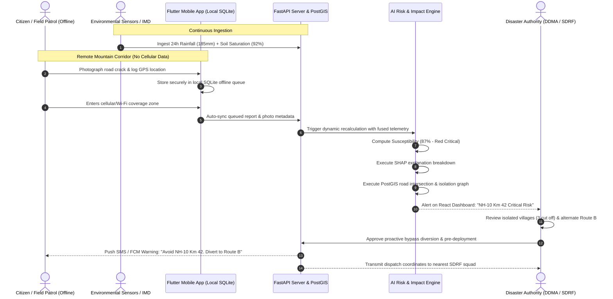

# SMART INDIA HACKATHON 2026 — OFFICIAL IDEA SUBMISSION
## Internal College Selection Round

---

### **PROJECT SUMMARY CARD**
* **Project Name:** **LANDSIGHT AI**
* **Tagline:** *"Predict Risk. Protect Lives. Connect Communities."*
* **Problem Statement ID:** **SIH26001**
* **Problem Title:** AI-Based Early Warning and Landslide Monitoring System in North Eastern Region (NER)
* **Organization:** Ministry of Development of North Eastern Region (MDoNER)
* **Category:** Software Edition
* **Theme:** Disaster Management
* **Target Geography:** 8 North Eastern States (Sikkim, Assam, Meghalaya, Arunachal Pradesh, Nagaland, Manipur, Mizoram, Tripura)

---

## 1. PROJECT TITLE
**LANDSIGHT AI: AI-Powered Early Warning, Dynamic Landslide Monitoring, and Connectivity Impact Intelligence System for the North Eastern Region**

---

## 2. PROBLEM UNDERSTANDING

### 2.1 The Geo-Climatic Crisis in the North Eastern Region
The North Eastern Region (NER) of India represents one of the most ecologically fragile and landslide-vulnerable landscapes in the world. Characterized by geologically young, steep Himalayan slopes, high seismic vulnerability (Seismic Zones V & IV), and intense monsoon downpours/cloudbursts exceeding 200 mm/day, the region experiences hundreds of slope failures annually.

### 2.2 Ground Realities and Practical Bottlenecks
1. **Critical Infrastructure Disruption:** Mountainous highways like NH-10 (the sole lifeline linking Sikkim to mainland India) and NH-29 (connecting Nagaland and Manipur) face recurring blockages, cutting off food supplies, petroleum, and military logistics.
2. **Isolation of Remote Villages:** Tribal hamlets nested in deep valleys are often connected by single unpaved or single-lane roads. A single landslide severs all access to primary health centers and district hospitals.
3. **Severe Connectivity Constraints:** Cellular towers and power lines are frequently downed during severe rainstorms, resulting in widespread internet dead-zones exactly when disaster reporting is most critical.
4. **Information Lag:** Ground reports from village panchayats or local police reach district disaster management authorities (DDMA) hours or days after landslides occur.
5. **The Fundamental Systemic Gap:** Existing academic models and regional weather bulletins focus strictly on **hazard probability** ("landslide likely in district X"). They fail to provide **impact intelligence**—failing to tell authorities *which specific road segments will be blocked, which villages will be isolated, which hospitals will become inaccessible, and what alternate corridors exist.*

### 2.3 The Paradigm Shift: Current Reality vs. LANDSIGHT AI Vision
* **Current Situation (Reactive):** 
  $$\text{Hazard Occurs} \longrightarrow \text{Disaster Strikes} \longrightarrow \text{Lifelines Severed} \longrightarrow \text{Delayed Reaction \& Evacuation}$$
* **LANDSIGHT AI Vision (Proactive):**
  $$\text{Multi-Source Sensing} \longrightarrow \text{Dynamic AI Risk} \longrightarrow \text{Connectivity Impact Mapping} \longrightarrow \text{Pre-Disaster Action \& Rerouting}$$

---

## 3. PROPOSED SOLUTION

**LANDSIGHT AI** is a modular, AI-powered decision-support and early-warning ecosystem engineered specifically for the practical realities of the North Eastern Region. Rather than acting as a static risk viewer, LANDSIGHT AI unites multi-source environmental and human sensing to forecast dynamic landslide risk at a 30-meter spatial resolution and instantly translates that risk into actionable **Connectivity and Human Impact Intelligence**.

### Core Pillars of the Solution:
1. **Multi-Source Data Ingestion:** Fuses satellite remote sensing, satellite radar/optical imagery, gridded rainfall forecasts, soil moisture measurements, elevation models, historical landslide inventories, and crowdsourced field observations.
2. **Dynamic AI Risk Engine:** Employs an explainable machine learning ensemble that continually updates localized slope instability scores as precipitation accumulates.
3. **Dynamic 4-Tier Risk Categorization:**
   * 🟢 **GREEN (Low Risk | 0–30%):** Stable terrain. Routine monitoring. Normal traffic flow.
   * 🟡 **YELLOW (Moderate Risk | 31–60%):** Elevated saturation or moderate rain. Highway alerts to Border Roads Organisation (BRO) and local traffic patrols.
   * 🟠 **ORANGE (High Risk | 61–80%):** Critical moisture saturation threshold reached. Freight/heavy vehicle diversions triggered; village disaster committees alerted.
   * 🔴 **RED (Critical Risk | 81–100%):** Imminent landslide danger. Automated citizen SMS/app broadcast, bypass routes activated, pre-positioning of SDRF/NDRF rescue teams.
4. **Connectivity & Isolation Intelligence Engine:** Evaluates the spatial intersection of high-risk slope polygons with road network graphs to predict cut-off communities and compute bypass routes.
5. **Offline-First Field Reporting Module:** Enables citizens and field officers in remote valleys to log geological warning signs (ground fissures, tilted trees, minor rockfalls) without an active internet connection.

---

## 4. HOW THE SYSTEM WORKS: END-TO-END WORKFLOW

```
  [DATA INGESTION LAYER]
  ├── IMD Automatic Weather Stations / Satellite GPM (Precipitation)
  ├── NASA / ISRO SMAP & Sentinel-1 (Soil Moisture Saturation)
  ├── CartoDEM / SRTM 30m Digital Elevation Models (Slope, Aspect, Curvature)
  ├── Sentinel-2 MSI Optical Imagery (NDVI, Land Cover, Deforestation)
  ├── GSI Bhukosh Open Landslide Inventory (Historical Failure Sites)
  └── Offline Citizen & Field Officer Mobile App (Crowdsourced Geotagged Reports)
                           │
                           ▼
  [DATA PROCESSING & HARMONIZATION LAYER (FastAPI + Pandas/NumPy)]
  ├── Spatial interpolation & coordinate re-projection to WGS84 / UTM
  ├── Antecedent Precipitation Index (API) calculation (24h, 72h, 7-day cumulative)
  ├── Feature normalization and slope-stability feature matrix construction
                           │
                           ▼
  [AI / MACHINE LEARNING RISK ENGINE (XGBoost + Random Forest Ensemble)]
  ├── Pixel-level Dynamic Landslide Susceptibility Calculation
  ├── Explainable AI (SHAP) Factor Attribution & Contribution Scoring
  └── Classification into 4 Dynamic Risk Bands (Green / Yellow / Orange / Red)
                           │
                           ▼
  [GEOSPATIAL & CONNECTIVITY IMPACT ENGINE (PostgreSQL + PostGIS + pgRouting)]
  ├── Dynamic Risk Heatmap generation & spatial polygon intersection
  ├── Road Network Vulnerability Analysis (Lifeline Highways & Arterial Roads)
  ├── Village Isolation Detection (Graph connectivity check on isolated nodes)
  ├── Hospital Accessibility Matrix (Calculates travel delay & cut-off health centers)
  └── Dijkstra / A* Emergency Alternate Route Determination
                           │
                           ▼
  [MULTI-CHANNEL OUTPUT & ACTION LAYER]
  ├── Authority Command Dashboard (React.js + Mapbox GL GIS visualization)
  ├── Citizen & Field Officer Mobile Application (Flutter + SQLite Offline Sync)
  ├── Common Alerting Protocol (CAP) SMS & Firebase Push Notifications
  └── Actionable Executive Directives for DDMA / SDRF / BRO
```

---

## 5. INNOVATION / UNIQUENESS (USPs)

### 🌟 Innovation 1: Dynamic Risk + Connectivity Impact Intelligence
* **The Distinction:** Existing research ends by rendering a colored polygon on a map. LANDSIGHT AI treats hazard prediction as only step one.
* **Impact Engine:** The platform couples the spatial risk layer with regional OpenStreetMap topological road graphs using PostGIS.
* **Proactive Outputs Generated Before Disaster Strikes:**
  * Identifies exact road segments at risk of being blocked.
  * Identifies remote villages that will be completely cut off from vehicular transit.
  * Identifies which primary health centers and district hospitals will become inaccessible.
  * Computes safe alternative bypass corridors for emergency vehicles and supply convoys.
  * Delivers a priority-ranked dispatch list for disaster management teams (e.g., "Clear Choke Point A first to restore access to 3 villages").

### 🌟 Innovation 2: Offline Community and Field Reporting System ("Crowd-Intelligence")
* **The Reality:** Remote valleys across Arunachal Pradesh, Sikkim, and Meghalaya lose mobile data connectivity during heavy monsoons.
* **The Solution:** A lightweight mobile app built with an **offline-first local database (SQLite)**.
* **Capabilities:**
  * Field officers and villagers can capture geotagged photos of developing tension cracks, soil creep, leaning utility poles, or blocked culverts.
  * Reports are time-stamped and encrypted locally on the device with hardware GPS coordinates.
  * **Zero Data Loss:** When the device enters an area with 2G, 3G, 4G, or Wi-Fi connectivity, the queue automatically synchronizes with the central FastAPI server via background delta workers.
  * Field reports serve as ground-truth validation to fine-tune the AI model's local confidence score.

### 🌟 Innovation 3: Explainable AI (XAI) for Authority Trust
* **The Problem:** Disaster management officials (District Magistrates, Police Superintendents, SDRF commanders) will not order evacuations or road closures based on a mysterious "black-box" risk percentage.
* **The Solution:** Integrated **SHAP (SHapley Additive exPlanations)** factor attribution converts complex mathematical predictions into clear, human-readable explanations.
* **Concrete Example Displayed on Authority UI:**
  ```
  LOCATION: NH-10 KM 42 (Melli-Teesta Stretch)
  RISK LEVEL: CRITICAL — 87%
  
  KEY CONTRIBUTING FACTORS:
  • Extreme Rainfall: 185 mm cumulative past 24 hours (+42% contribution)
  • Soil Moisture: 92% saturation index (+21% contribution)
  • Steep Slope: 52° gradient with fractured shale bedrock (+15% contribution)
  • Historical Vulnerability: 3 past slide events within 200m (+5% contribution)
  • Field Intelligence: 2 citizen reports of 5cm road subsidence filed 4h ago (+4% contribution)
  ```
* **Benefit:** Authorities understand *why* the warning was issued, ensuring confidence during evacuation orders and eliminating alert fatigue.

---

## 6. KEY SYSTEM FEATURES

| Module | Feature | Target User | Practical Functionality |
| :--- | :--- | :--- | :--- |
| **Authority Command Center** | **Interactive 3D GIS Risk Map** | DDMA / MDoNER / SDRF | Real-time map with toggles for satellite imagery, road networks, risk zones, and hospital layers. |
| **Impact Analytics** | **Isolation Predictor** | District Magistrates / BRO | One-click report listing all villages at risk of isolation in the next 12 hours with estimated population counts. |
| **Emergency Routing** | **Dynamic Bypass Generator** | Emergency Ambulances / SDRF | Autonomous calculation of open alternative routes bypassing blocked hill road corridors. |
| **Field Intelligence** | **Offline Crack & Slip Reporter** | Citizens / Panchayat / BRO Patrols | Camera capture with EXIF geotagging, severity rating, and background synchronization. |
| **Early Warning** | **Hyper-Local Push & SMS Alerts** | General Public & Transporters | Geo-fenced notifications in English, Hindi, and regional languages alerting drivers before entering red zones. |
| **Audit & Explanation** | **XAI Diagnostic Inspector** | Disaster Analysts / Geologists | Detailed breakdown of environmental triggers behind every risk polygon. |

---

## 7. FEASIBLE TECHNOLOGY STACK

To ensure that the project is completely feasible for an undergraduate hackathon team within SIH constraints, every technology has been chosen for high performance, open-source availability, and zero hardware licensing costs:

```
┌─────────────────────────────────────────────────────────────────────────────┐
│                             PRESENTATION LAYER                              │
│  Authority Web Dashboard: React.js (v18) + Tailwind CSS + Mapbox GL JS /   │
│                          Leaflet.js + Recharts Analytics                    │
│  Mobile Application:     Flutter (Dart) + SQLite (sqflite) + Offline PWA    │
└──────────────────────────────────────┬──────────────────────────────────────┘
                                       │ REST / GeoJSON / WebSocket
┌──────────────────────────────────────▼──────────────────────────────────────┐
│                            BACKEND SERVICES LAYER                           │
│  API Gateway & Engine:   Python 3.11 + FastAPI (Asynchronous, High QPS)     │
│  Data Pipelines:         Pandas, NumPy, GeoPandas, Rasterio, Shapely        │
│  Task Queue:             Celery + Redis (Background weather polling & sync) │
└──────────────────────────────────────┬──────────────────────────────────────┘
                                       │
┌──────────────────────────────────────▼──────────────────────────────────────┐
│                          AI & ANALYTICS ML LAYER                            │
│  Predictive Ensemble:    XGBoost Classifier + Random Forest (Scikit-Learn) │
│  Explainability Engine:  SHAP (SHapley Additive exPlanations)               │
│  Routing & Graph:        NetworkX & pgRouting (Dijkstra Shortest Safe Path) │
└──────────────────────────────────────┬──────────────────────────────────────┘
                                       │
┌──────────────────────────────────────▼──────────────────────────────────────┐
│                           DATA & STORAGE LAYER                              │
│  Primary Geospatial DB:  PostgreSQL 16 + PostGIS Extension (Spatial Indexes) │
│  Local Mobile Storage:   SQLite (Encrypted local queue for offline sync)    │
│  Satellite & Weather:    IMD Gridded API, NASA SMAP, SRTM 30m, Sentinel-2   │
│  Push Notifications:     Firebase Cloud Messaging (FCM) + Twilio/Govt SMS  │
│  Cloud Deployment:       AWS EC2 (Free Tier / Student Credits) + S3 Bucket  │
└─────────────────────────────────────────────────────────────────────────────┘
```

---

## 8. SYSTEM ARCHITECTURE

```mermaid
flowchart TD
    subgraph SENSING["1. MULTI-SOURCE SENSING & DATA INGESTION"]
        D1[IMD Weather Stations & GPM Precipitation]
        D2[NASA / ISRO SMAP Soil Moisture]
        D3[SRTM / CartoDEM Elevation & Slope]
        D4[Sentinel-2 Satellite Vegetation / NDVI]
        D5[GSI Bhukosh Historical Landslides]
        D6[Offline Citizen & Field Officer Reports]
    end

    subgraph BACKEND["2. DATA HARMONIZATION & AI RISK ENGINE"]
        B1[FastAPI Ingestion & Spatial Coordinate Harmonization]
        B2[Antecedent Moisture & Cumulative Rainfall Feature Pipeline]
        B3[XGBoost + Random Forest Machine Learning Ensemble]
        B4[Explainable AI Engine - SHAP Factor Attributions]
        B5[Dynamic Risk Score: Green | Yellow | Orange | Red]
    end

    subgraph IMPACT["3. GEOSPATIAL CONNECTIVITY & IMPACT ENGINE"]
        I1[PostgreSQL + PostGIS Spatial Geodatabase]
        I2[Road Network Overlay & Blockage Forecast]
        I3[Isolated Village Identification Graph Engine]
        I4[Critical Healthcare & Hospital Access Analyzer]
        I5[Dynamic Alternative Emergency Route Planner]
    end

    subgraph CLIENT["4. MULTI-CHANNEL DISPATCH & STAKEHOLDER INTERACTION"]
        C1[Authority Web Dashboard - React.js + Mapbox GL]
        C2[Citizen & Field Mobile App - Flutter + Offline SQLite]
        C3[Geo-Fenced Push Notifications & CAP SMS Alerts]
        C4[First Responders: SDRF / NDRF / BRO Highway Patrols]
    end

    D1 --> B1
    D2 --> B1
    D3 --> B1
    D4 --> B1
    D5 --> B1
    D6 -->|Auto-Sync via REST| B1

    B1 --> B2 --> B3 --> B4 --> B5
    B5 --> I1
    I1 --> I2 --> I3 --> I4 --> I5

    I2 --> C1
    I3 --> C1
    I4 --> C1
    I5 --> C1

    B5 --> C2
    I5 --> C2
    B5 --> C3
    I5 --> C4
```

---

## 9. USER JOURNEY / WORKFLOW DIAGRAM



---

## 10. REALISTIC PHASED IMPLEMENTATION PLAN

| Phase | Milestone | Core Deliverables | Timeline (Hackathon) | Team Focus |
| :--- | :--- | :--- | :--- | :--- |
| **Phase 1** | **Data Preparation & Ingestion** | Collect SRTM 30m DEM for sample NER district (e.g., Gangtok/Mangan or Dima Hasao); download GSI historical landslide catalog; mock IMD API rainfall ingestion pipeline. | Week 1–2 (Pre-Hackathon) | Data Eng & ML Lead |
| **Phase 2** | **Risk Prediction Model & XAI** | Train XGBoost & Random Forest classifier on combined static + dynamic features; integrate SHAP explainer to calculate factor contribution weights. | Week 3 | AI/ML Lead |
| **Phase 3** | **GIS Visualization & PostGIS** | Set up PostgreSQL with PostGIS; build interactive React + Mapbox dashboard rendering 4-color risk polygons and road network overlays. | Week 4 | Full Stack & GIS Lead |
| **Phase 4** | **Connectivity Impact Engine** | Implement network graph algorithms (Dijkstra) in Python/pgRouting to detect disconnected village nodes and compute open emergency bypass routes. | Week 5 | Backend & Algorithm Lead |
| **Phase 5** | **Offline Mobile App & Sync** | Develop Flutter mobile client with SQLite local cache; camera integration for crack reporting; implement automatic sync on reconnection. | Week 6 | Mobile App Developer |
| **Phase 6** | **Integration, Testing & Simulation** | End-to-end simulation of a 150mm monsoon cloudburst scenario; validate UI responsiveness; prepare college demo scripts & pitch. | Hackathon Prototype Day | All 6 Members |

---

## 11. TECHNICAL FEASIBILITY & REALISM

1. **No Expensive Physical Hardware Needed:** Unlike traditional slope-monitoring approaches that require expensive geotechnical inclinometers, borehole piezometers, and acoustic sensors on every hill (costing crores), LANDSIGHT AI operates using **remote sensing and cloud telemetry**.
2. **Open Data Availability:**
   * **Elevation/Slope:** SRTM 30m DEM and CartoDEM are open access via USGS and ISRO Bhuvan.
   * **Rainfall:** IMD gridded daily data and NASA GPM (Global Precipitation Measurement) satellite feeds are openly accessible via REST APIs.
   * **Historical Data:** Geological Survey of India (GSI) Bhukosh portal provides documented landslide points across the North East.
   * **Road Networks:** OpenStreetMap (OSM) road vectors for Sikkim, Assam, and Meghalaya are freely downloadable in Shapefile/GeoJSON format.
3. **Honest Academic Realism:** We do **not** claim 100% predictive accuracy or pinpoint hour-exact slide occurrences. LANDSIGHT AI is engineered as an **early-warning decision-support tool** that reduces uncertainty, filters false alarms, and automates connectivity impact assessment.

---

## 12. EXPECTED IMPACT

* **6 to 12-Hour Evacuation Window:** Shifts disaster response from chaotic post-tragedy excavation to orderly pre-disaster evacuation.
* **Preserving Critical Lifelines:** Eliminates mass passenger stranding on arterial corridors like NH-10 (Sikkim) and NH-29 (Nagaland) through timely diversions.
* **Saving Remote Communities:** Zero blindspots—offline ground-truth sync ensures that remote tribal hamlets without telecommunication have their warnings acknowledged.
* **Targeted Emergency Resource Allocation:** Informs district authorities *which* excavator to deploy, *which* bypass to secure, and *which* isolated village requires medical airdrops first.
* **Substantial Economic Savings:** Prevents multi-crore losses in damaged logistics trucks, prolonged highway trade blockades, and emergency disaster relief expenses.

---

## 13. FUTURE SCOPE & EXTENSION

1. **Automated Drone Photogrammetry:** Deploy autonomous edge-computing drones to capture 3D point-cloud scans along critical fracture lines flagged by citizen reports.
2. **InSAR Radar Satellite Subsidence Tracking:** Integrate European Space Agency (ESA) Sentinel-1 Synthetic Aperture Radar interferometry to measure sub-centimeter ground subsidence prior to catastrophic slope collapse.
3. **Direct Integration with National Disaster Portals:** Plug APIs directly into the **NDMA National Emergency Communication Plan**, **112 Emergency India**, and the **Border Roads Organisation (BRO) Project Swastik/Pushpak**.
4. **Multilingual Audio Broadcasts:** Provide voice-based early warnings via mobile IVR and community radio in local North Eastern languages (Assamese, Bengali, Nepali, Mizo, Khasi, Garo, Bodo).
5. **Pan-Himalayan Expansion:** Scale the model seamlessly from the North Eastern Region to Himachal Pradesh, Uttarakhand, and Jammu & Kashmir.

---

## 14. REALISTIC PROTOTYPE DEMONSTRATION SCENARIO FOR EVALUATORS

**Scenario Setting:** Monsoon Cloudburst along the **NH-10 Teesta Valley Corridor (Sikkim–West Bengal border)**.

1. **Step 1 (Environmental Trigger):** 
   * In the prototype demo, the team feeds simulated live IMD telemetry indicating 185 mm rainfall over 24 hours in the Melli–Singtam sector.
   * Soil moisture saturation index crosses 90%.
2. **Step 2 (Citizen Ground Report - Offline):** 
   * A field volunteer using the LANDSIGHT mobile app in an offline zone takes a picture of a newly opened 10-meter road fracture near 29th Mile.
   * The app stores the report in SQLite.
   * As the volunteer's vehicle reaches an area with signal, the report auto-syncs to the dashboard.
3. **Step 3 (AI Dynamic Assessment & XAI):**
   * The AI engine elevates the zone from **YELLOW** to **RED (Critical Risk - 87%)**.
   * The XAI modal displays: *Contributing Factors: Rainfall 42%, Saturation 21%, 48° Slope 15%, Ground Report 9%*.
4. **Step 4 (Connectivity Impact Intelligence):**
   * The map instantly flashes the affected 3 km stretch of NH-10 in Red.
   * The **Impact Panel** reveals:
     * *Direct Threat: NH-10 Km 29 Choke Point.*
     * *Villages Cut Off: 3 Hamlets (Lower Melli, Tarkhola, Rambi) isolated from Singtam District Hospital.*
     * *Alternative Route Generated: Reroute medical traffic via Damdim–Algarah–Reshi–Rhenock corridor (Route B).*
5. **Step 5 (Multi-Agency Alert Output):**
   * Automated SMS notification sent to registered transport operators.
   * Priority alert pinged to BRO rescue outpost at Teesta Bazar.

---

## 15. 60-SECOND PITCH FOR PROFESSORS & INTERNAL JURY

> *"Good morning, respected professors and evaluation committee.*
> 
> *Every monsoon, landslides paralyze the North Eastern Region. Highways like NH-10 and NH-29 are severed, cutting off food supplies, trapping patients, and isolating hundreds of remote tribal villages for weeks.*
> 
> *Current disaster systems are fundamentally reactive: they detect the hazard only after the mountain collapses, and existing research merely predicts that 'a landslide might happen'—without telling anyone what will actually be destroyed.*
> 
> *We present **LANDSIGHT AI: Predict Risk. Protect Lives. Connect Communities.***
> 
> *LANDSIGHT AI introduces three major breakthroughs:*
> * *First, **Connectivity Impact Intelligence**: We don't just predict the landslide; our spatial graph engine instantly predicts which roads will collapse, which villages will become isolated, which hospitals will be cut off, and autonomously computes safe alternate bypass routes before disaster strikes.*
> * *Second, an **Offline-First Community Reporting System**: A lightweight mobile app allowing villagers and field officers in remote zero-network valleys to log ground cracks and photos, automatically syncing once connection returns.*
> * *Third, **Explainable AI**: We give district magistrates transparent reasons—showing exactly what percentage of rainfall, slope, and moisture drove the critical alert.*
> 
> *Using open satellite data, standard weather APIs, and open-source geospatial tools, our prototype is fully feasible, cost-effective, and engineered specifically to save lives in North East India.*
> 
> *Thank you, and we welcome your questions!"*

---
